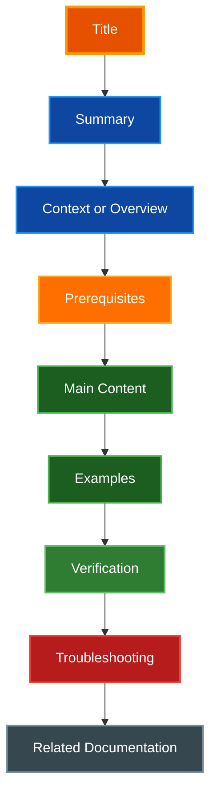
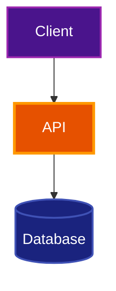
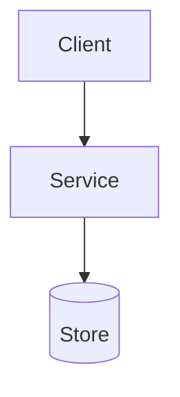

# Documentation Style Guide

A generic style guide for writing clear, maintainable technical documentation. Use it as a baseline for project READMEs, guides, references, runbooks, architecture notes, and API documentation.

## Table of Contents

- [Quick Reference](#quick-reference)
- [Core Principles](#core-principles)
- [Document Types](#document-types)
- [Document Structure](#document-structure)
- [Writing Style](#writing-style)
- [Formatting Standards](#formatting-standards)
- [Code and Command Examples](#code-and-command-examples)
- [Diagrams and Visuals](#diagrams-and-visuals)
- [API Documentation](#api-documentation)
- [File Organization](#file-organization)
- [Maintenance](#maintenance)
- [Review Checklist](#review-checklist)
- [Templates](#templates)

## Quick Reference

### Essential Rules

- Write for the reader's task, not the author's implementation details
- Start every document with a clear H1 title and a short summary
- Include a table of contents for long documents or documents with many sections
- Use active voice, direct language, and consistent terminology
- Specify a language for every fenced code block
- Prefer copy-paste-friendly commands without shell prompts
- Test examples before publishing when practical
- Use Mermaid for architecture, flow, sequence, state, and relationship diagrams
- Use text trees for directory structures and terminal-style blocks for transcripts
- Avoid line numbers in durable file references unless tied to a specific commit or ephemeral review
- Avoid duplicating dependency versions already defined in package manifests
- Update related links, examples, and references when changing documentation

### Prefer This

````markdown
The `createClient()` function reads configuration from `config.yaml`.

```bash
example-cli validate config.yaml
```
````

### Avoid This

````markdown
The functionality located at `src/client.ts:184` should be utilized by users.

```bash
$ example-cli validate config.yaml
```
````

Use shell prompts only for interactive transcripts, not for commands intended to be copied.

## Core Principles

| Principle | Guidance |
| --- | --- |
| **Clarity** | Say exactly what the reader needs to know or do |
| **Accuracy** | Keep examples, links, and behavior aligned with the current implementation |
| **Scannability** | Use headings, lists, tables, and examples to support quick reading |
| **Maintainability** | Avoid brittle details such as line numbers, duplicated versions, and stale screenshots |
| **Consistency** | Use the same names, terms, capitalization, and structure across related docs |
| **Accessibility** | Do not rely on color alone; provide labels, descriptions, and readable contrast |

## Document Types

Different documents need different structures. Do not force every document into the same template.

| Type | Purpose | Recommended Sections |
| --- | --- | --- |
| **README** | Orient new users and contributors | Purpose, install/setup, quick usage, development, links |
| **Quickstart** | Help users succeed quickly | Prerequisites, steps, verification, next steps |
| **How-to guide** | Complete a specific task | Goal, prerequisites, steps, troubleshooting, verification |
| **Reference** | Provide complete facts/options | Scope, concepts, options/API, examples, related docs |
| **Architecture note** | Explain design and tradeoffs | Context, goals, components, data/control flow, tradeoffs, risks |
| **Runbook** | Operate or recover a system | Symptoms, impact, diagnosis, remediation, rollback, escalation |
| **Troubleshooting** | Resolve known issues | Symptoms, likely causes, fixes, verification |
| **Migration guide** | Move between versions or systems | Audience, breaking changes, preparation, steps, rollback, validation |
| **Changelog/release notes** | Record released changes | Version/date, added/changed/fixed/removed, migration notes |

## Document Structure

### Required Baseline

Every durable documentation file should include:

1. **Title (H1):** One clear document title
2. **Summary:** One or two sentences explaining scope and audience
3. **Main content:** Sections organized by reader workflow
4. **Related links:** Relevant follow-up docs when useful

Longer documents should also include:

- **Table of contents:** For documents over roughly 500 words or with more than three major sections
- **Prerequisites:** For procedural docs that assume tools, access, or background knowledge
- **Verification:** For setup, operations, and troubleshooting docs
- **Troubleshooting:** For workflows with common failure modes

### Heading Hierarchy

| Level | Use | Example |
| --- | --- | --- |
| H1 | Document title only | `# Deployment Guide` |
| H2 | Major sections | `## Configure the Service` |
| H3 | Subsections | `### Environment Variables` |
| H4 | Small divisions inside complex sections | `#### Retry Behavior` |
| H5+ | Avoid when possible | Prefer lists or split the section |

### Recommended Information Flow



## Writing Style

### Voice and Tone

- **Direct:** Tell readers what to do and what happens next
- **Professional:** Be precise without sounding bureaucratic
- **Approachable:** Explain unfamiliar concepts before using shorthand
- **Inclusive:** Avoid assumptions about the reader's background, location, or tooling
- **Current:** Use present tense for current behavior

### Style Rules

| Do | Avoid |
| --- | --- |
| “Run the command to validate the configuration.” | “The command should be executed in order to validate the configuration.” |
| “The API returns JSON.” | “JSON is returned by the API.” |
| “Set `timeoutSeconds` to `30`.” | “Set an appropriate timeout value.” |
| “Use `repository`, not `repo`, in this file.” | Mixing “repository”, “repo”, and “project” for the same concept |

### Terminology

- Define acronyms on first use: “Application Programming Interface (API)”
- Prefer one canonical term for each concept
- Use product, command, and package names exactly as they appear in the project
- Avoid jokes, idioms, or culture-specific phrases in technical instructions

### Procedural Writing

For step-by-step instructions:

1. Start each step with an action verb
2. Include only one primary action per step
3. Explain why when the reason affects user choice or safety
4. Show expected output or success criteria when useful
5. End with verification

## Formatting Standards

### Inline Formatting

| Element | Format | Example |
| --- | --- | --- |
| File paths | Backticks | `src/config.ts` |
| Commands | Backticks or fenced blocks | `example-cli init` |
| Function/class names | Backticks | `createClient()` |
| Environment variables | Backticks | `API_KEY` |
| UI labels | Bold or quoted consistently | **Save** |
| Emphasis | Bold sparingly | **Important:** |

### File References

Avoid line numbers in durable documentation because they become stale after edits.

Good:

- “See `src/client.ts` for the client implementation.”
- “The `createClient()` function validates the options object.”
- “The deployment workflow lives in `.github/workflows/deploy.yml`.”

Avoid:

- “See `src/client.ts:184`.”
- “Update lines 20-45 in `config.ts`.”
- “The bug is fixed at `/Users/example/project/src/client.ts:184`.”

Line numbers are acceptable in temporary debugging notes, issue comments, or review comments tied to a specific commit SHA.

### Version References

Avoid duplicating dependency or package versions in general documentation. Version numbers drift and should usually live in package manifests, lockfiles, release notes, or generated API references.

Good:

- “See the project manifest for dependency versions.”
- “Requires the runtime version specified by the project configuration.”
- “Use the version documented in the package manifest.”

Acceptable places for versions:

- Changelogs and release notes
- Migration guides
- Compatibility matrices
- Security advisories
- Troubleshooting notes for version-specific bugs
- Package manifests and lockfiles

### Callouts

Use blockquotes for important contextual notes. Keep them short.

> **Note:** Additional context that helps understanding.

> **Tip:** A helpful shortcut or best practice.

> **Warning:** A risk that can cause data loss, downtime, or confusing behavior.

> **Security:** Information related to secrets, permissions, data exposure, or trust boundaries.

> **Deprecated:** A feature or approach that should no longer be used.

## Code and Command Examples

### Code Blocks

Always specify a language for fenced code blocks.

````markdown
```ts
export interface ClientOptions {
  endpoint: string;
  timeoutSeconds?: number;
}
```
````

Use comments to explain why code is written a certain way, not to restate obvious operations.

```ts
const cacheTtlSeconds = 300; // Balances freshness with upstream rate limits.
```

### Commands

Use copy-paste-friendly commands without a prompt when the reader should run them directly.

```bash
example-cli validate config.yaml
example-cli deploy --dry-run
```

Use prompts only for transcripts or interactive sessions.

```text
$ example-cli status
Service: healthy
Queue: empty
```

### Expected Output

Include output when it helps readers confirm success. Keep long output abbreviated.

```bash
example-cli test
```

```text
✓ Configuration loaded
✓ Connection established
✓ Checks passed
```

### Secrets and Credentials

- Never include real API keys, tokens, passwords, private keys, or connection strings
- Use placeholders such as `<API_KEY>` or `example-token`
- Make clear where secrets should be stored
- Warn when a workflow crosses a trust boundary, such as browser-to-server credentials

### Error Examples

Show the symptom, cause, fix, and verification.

````markdown
#### Error: `Permission denied`

**Symptom:** The command exits with `Permission denied`.

**Likely cause:** The current user cannot read the configuration file.

**Fix:** Update file ownership or run the command with the correct user.

```bash
example-cli validate config.yaml
```

**Verify:** The command exits successfully and prints `Configuration valid`.
````

## Diagrams and Visuals

### When to Use Mermaid

Use Mermaid for:

- Architecture diagrams
- Flow charts
- Sequence diagrams
- State diagrams
- Entity relationship diagrams
- Dependency diagrams

Use text blocks for:

- Directory trees
- Terminal transcripts
- Simple before/after file layouts

### Mermaid Style

Prefer `classDef` styles over repeated per-node `style` declarations.



### Diagram Color Palette

Use high-contrast colors and clear labels. Do not rely on color alone to convey meaning.

| Semantic Role | Fill | Stroke | Use |
| --- | --- | --- | --- |
| Primary | `#e65100` | `#ff9800` | Main service or orchestration point |
| Active/Healthy | `#1b5e20` | `#4caf50` | Healthy components or active paths |
| Success | `#2e7d32` | `#66bb6a` | Successful states or completed operations |
| Error/Failed | `#b71c1c` | `#f44336` | Failures or unavailable components |
| Warning | `#ff6f00` | `#ffa726` | Risk, decision, or caution points |
| Data/Storage | `#0d47a1` | `#2196f3` | Caches, queues, or data services |
| Database | `#1a237e` | `#3f51b5` | Persistent storage |
| External/Client | `#4a148c` | `#9c27b0` | Users, clients, external systems |
| Neutral/Info | `#37474f` | `#78909c` | Notes, inactive components, or metadata |

### Accessibility

- Label states and arrows clearly
- Add a short explanation before or after complex diagrams
- Provide alt text or captions for images
- Avoid tiny text in screenshots
- Prefer diagrams that remain readable in light and dark themes

## API Documentation

### Endpoint Template

````markdown
### Create Resource

Creates a resource and returns the created representation.

**Method:** `POST`
**Path:** `/api/resources`
**Authentication:** Required

#### Request Headers

| Header | Required | Description |
| --- | --- | --- |
| `Authorization` | Yes | Bearer token |
| `Content-Type` | Yes | `application/json` |

#### Request Body

```json
{
  "name": "example",
  "enabled": true
}
```

#### Success Response

**Status:** `201 Created`

```json
{
  "id": "resource_123",
  "name": "example",
  "enabled": true
}
```

#### Error Responses

| Status | Cause | Response |
| --- | --- | --- |
| `400 Bad Request` | Invalid input | Validation error details |
| `401 Unauthorized` | Missing or invalid credentials | Authentication error |
| `409 Conflict` | Resource already exists | Conflict error |

#### Example

```bash
curl -X POST https://api.example.com/resources \
  -H "Authorization: Bearer <TOKEN>" \
  -H "Content-Type: application/json" \
  -d '{"name":"example","enabled":true}'
```
````

### API Reference Guidelines

- Document authentication and authorization requirements
- List path, query, header, and body parameters separately
- Include data types, required status, defaults, and constraints
- Show success and common error responses
- Include idempotency, pagination, rate limit, and retry behavior when relevant
- Keep examples safe: no real credentials or production identifiers

## File Organization

### Common Documentation Layout

```text
docs/
├── README.md
├── DOCUMENTATION_STYLE_GUIDE.md
├── architecture/
│   └── system-overview.md
├── guides/
│   └── deployment.md
├── reference/
│   └── configuration.md
├── runbooks/
│   └── service-recovery.md
└── troubleshooting/
    └── common-errors.md
```

Directory trees are allowed even though they use text characters; they are not a substitute for architecture or flow diagrams.

### Naming Conventions

Choose one naming convention per project and use it consistently.

Common options:

| Convention | Example | Notes |
| --- | --- | --- |
| Lowercase kebab-case | `deployment-guide.md` | Good for web docs and static site generators |
| Upper snake case | `DEPLOYMENT_GUIDE.md` | Common in repo-root docs |
| Conventional root names | `README.md`, `CONTRIBUTING.md` | Use established ecosystem names |

Avoid renaming existing documentation solely for style unless the project is already doing a documentation reorganization.

## Maintenance

### Documentation Lifecycle


### Update Checklist

When changing documentation:

1. Check whether linked docs also need updates
2. Update internal anchors if headings changed
3. Verify examples still match the implementation
4. Remove stale screenshots, diagrams, and references
5. Run available documentation checks
6. Add release notes or changelog entries when the change affects users

### Recommended Automated Checks

Use whichever tools fit the project:

- Markdown linting
- Link validation
- Spell checking or terminology checks
- Code block extraction and testing
- Mermaid rendering validation
- API reference generation or schema validation

## Review Checklist

### Structure

- [ ] One H1 title
- [ ] Clear summary near the top
- [ ] Table of contents when useful
- [ ] Headings follow a logical hierarchy
- [ ] Related links are present when helpful

### Content

- [ ] The intended audience is clear
- [ ] The document answers the reader's likely task or question
- [ ] Terms are defined and used consistently
- [ ] Assumptions and prerequisites are explicit
- [ ] Safety, security, and rollback notes are included where relevant

### Examples

- [ ] Code blocks specify languages
- [ ] Commands are copy-paste friendly unless shown as transcripts
- [ ] Examples use placeholders instead of real secrets
- [ ] Expected output or verification is included when useful
- [ ] Examples have been tested or clearly marked as illustrative

### Links and Maintenance

- [ ] Internal links and anchors work
- [ ] External links are still valid
- [ ] File references avoid brittle line numbers
- [ ] Version references are necessary and maintainable
- [ ] Related docs and changelogs are updated when needed

### Visuals

- [ ] Mermaid is used for diagrams where appropriate
- [ ] Directory trees are formatted as `text`
- [ ] Diagrams include clear labels and do not rely on color alone
- [ ] Images have alt text or nearby descriptions

## Templates

### General Guide Template

````markdown
# Guide Title

One or two sentences describing what this guide helps the reader accomplish.

## Table of Contents

- [Overview](#overview)
- [Prerequisites](#prerequisites)
- [Steps](#steps)
- [Verify](#verify)
- [Troubleshooting](#troubleshooting)
- [Related Documentation](#related-documentation)

## Overview

Explain the goal, scope, and expected outcome.

## Prerequisites

- Required access
- Required tools
- Required configuration

## Steps

1. **Do the first action**

   ```bash
   example-cli prepare
   ```

2. **Do the second action**

   ```bash
   example-cli apply
   ```

## Verify

```bash
example-cli status
```

Expected result: the command reports a healthy status.

## Troubleshooting

### Problem: Brief symptom

**Cause:** Likely cause.

**Fix:** Corrective action.

**Verify:** How to confirm the fix worked.

## Related Documentation

- [Related topic](related-topic.md) - Why it is useful
````

### Architecture Note Template

````markdown
# Architecture: System or Feature Name

Brief summary of the design and why it exists.

## Context

What problem this design addresses and what constraints shaped it.

## Goals

- Goal one
- Goal two

## Non-Goals

- Explicitly out-of-scope item

## Components



## Data Flow

Describe how data or control moves through the system.

## Tradeoffs

| Choice | Benefit | Cost |
| --- | --- | --- |
| Selected approach | Why it helps | What it makes harder |

## Operational Notes

Monitoring, deployment, rollback, and failure-mode considerations.

## Related Documentation

- [Related guide](related-guide.md)
````

### Troubleshooting Template

````markdown
# Troubleshooting: Problem Area

Use this guide to diagnose and resolve common problems with the system or workflow.

## Symptom: Brief Description

**Impact:** What the user or system experiences.

**Likely causes:**

- Cause one
- Cause two

**Diagnosis:**

```bash
example-cli diagnose
```

**Fix:**

```bash
example-cli repair
```

**Verify:**

```bash
example-cli status
```

Expected result: the status is healthy.

**Escalate if:** Conditions that require additional help.
````
