# PAR LLAMA Project Design Document

## Executive Summary

PAR LLAMA is a sophisticated Terminal User Interface (TUI) application for managing and interacting with Large Language Models (LLMs). Built on the Textual framework, it provides a comprehensive interface for both local (Ollama) and cloud-based LLM providers through a unified, extensible architecture.

## Table of Contents

1. [Architecture Overview](#architecture-overview)
2. [Application Startup and Initialization](#application-startup-and-initialization)
3. [UI Architecture](#ui-architecture)
4. [Message System and Event Flows](#message-system-and-event-flows)
5. [Data Models and Persistence](#data-models-and-persistence)
6. [Provider Integration System](#provider-integration-system)
7. [Configuration Management System](#configuration-management-system)
8. [Widget Hierarchy](#widget-hierarchy)
9. [Key Design Patterns](#key-design-patterns)
10. [Architecture Diagrams](#architecture-diagrams)

## Architecture Overview

PAR LLAMA follows a layered architecture with clear separation of concerns:

```
┌─────────────────────────────────────────────────────────┐
│                    UI Layer (Textual)                    │
│  Screens, Views, Widgets, Dialogs, User Interactions    │
├─────────────────────────────────────────────────────────┤
│                  Message System Layer                    │
│    Textual Messages (UI) | Par Events (Background)      │
├─────────────────────────────────────────────────────────┤
│                   Business Logic Layer                   │
│  Managers, Sessions, Providers, Job Processing          │
├─────────────────────────────────────────────────────────┤
│                Configuration Management Layer            │
│   Settings Manager, Environment Variables, Validation   │
├─────────────────────────────────────────────────────────┤
│                 Data Persistence Layer                   │
│   JSON Files, Settings, Themes, Sessions, Prompts       │
├─────────────────────────────────────────────────────────┤
│                  External Services Layer                 │
│      Ollama API, OpenAI, Anthropic, Other LLMs         │
└─────────────────────────────────────────────────────────┘
```

## Application Startup and Initialization

### Entry Point Flow

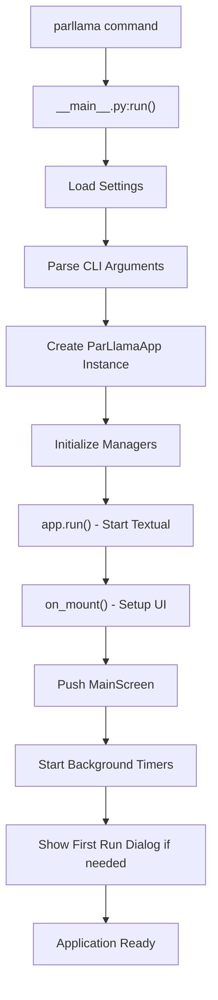

### Key Initialization Steps

1. **Settings Loading**: Global singleton `settings` object created
2. **Manager Registration**: Theme, Provider, Secrets, Ollama, Chat managers initialized
3. **UI Creation**: MainScreen with tabbed interface constructed
4. **Background Tasks**: Job processing and PS polling timers started

## UI Architecture

### Screen Hierarchy

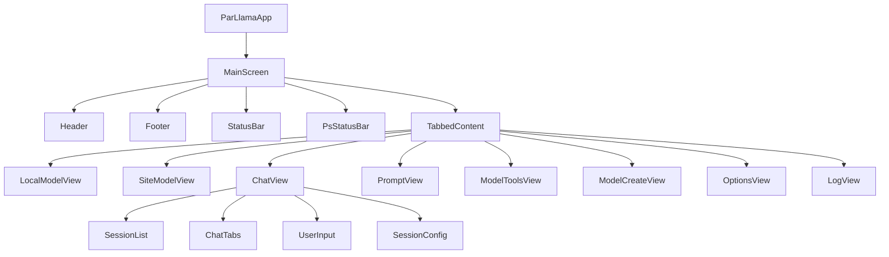

### Navigation Patterns

- **Tab-based**: Primary navigation through tabbed interface
- **Modal Dialogs**: Overlays for focused interactions
- **Message-driven**: Components communicate via messages
- **Keyboard-centric**: Extensive keyboard shortcuts

## Message System and Event Flows

### Dual Message Architecture

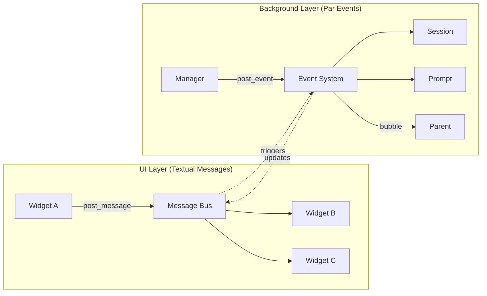

### Key Message Flows

#### Chat Message Flow

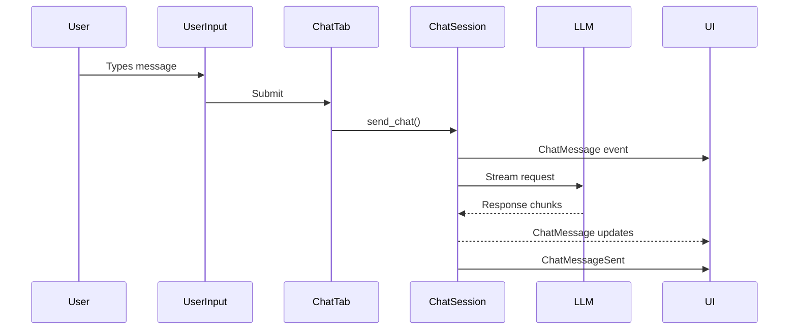

#### Model Pull Operation

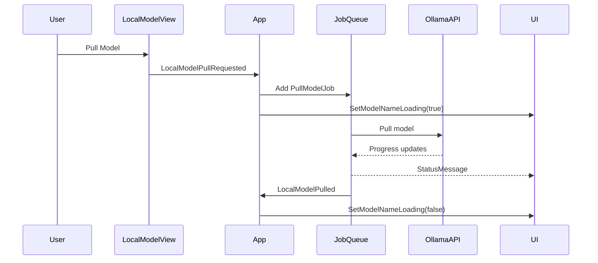

## Data Models and Persistence

### Data Architecture

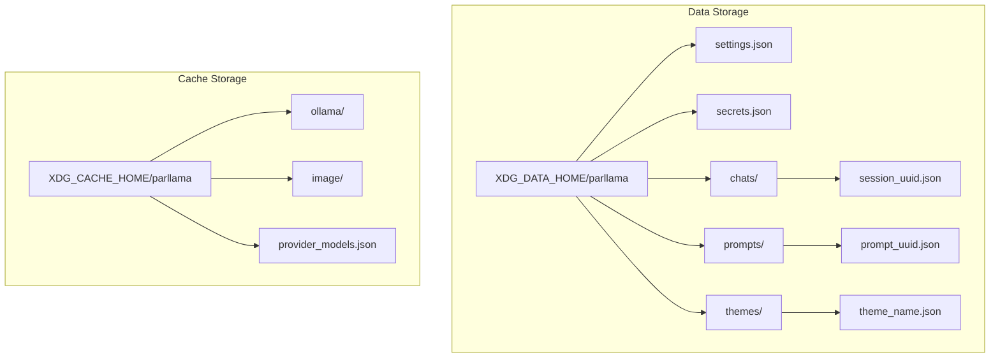

### Key Data Models

- **Settings**: Application configuration, preferences
- **ChatSession**: Conversation history, LLM config, messages
- **ParllamaChatMessage**: Multi-modal messages with metadata
- **ChatPrompt**: Reusable prompt templates
- **LlmConfig**: Provider-specific model configuration

### Persistence Features

- **Lazy Loading**: Sessions/prompts loaded on-demand
- **Auto-save**: Changes saved immediately with dirty tracking
- **Encryption**: Optional password protection for sessions
- **Migration**: Automatic path migration to XDG standards

## Provider Integration System

### Provider Architecture

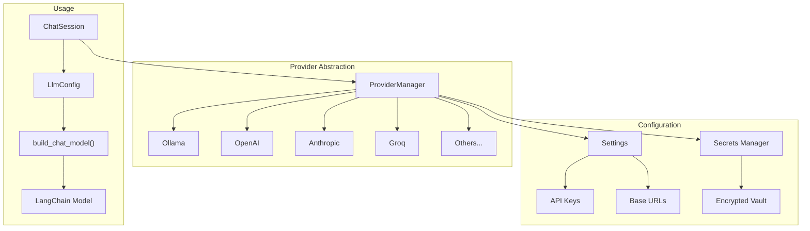

### Provider Features

- **Unified Interface**: All providers accessed through same API
- **Dynamic Discovery**: Models fetched from provider APIs
- **Caching**: Model lists cached locally (7-day expiration)
- **Security**: Multi-layer API key protection
- **Extensibility**: Easy to add new providers

## Configuration Management System

PAR LLAMA implements a comprehensive configuration management system that centralizes all configurable parameters and eliminates hard-coded values throughout the application.

### Configuration Architecture

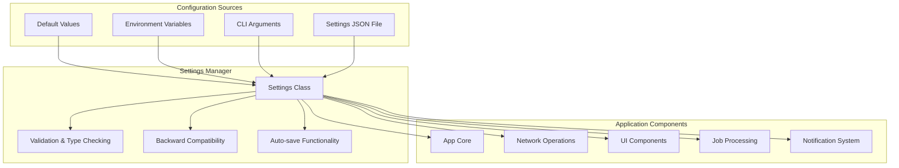

### Configuration Categories

#### 1. Timer and Job Processing Settings
- **job_timer_interval**: Job processing loop interval (default: 1.0s)
- **ps_timer_interval**: Process status update interval (default: 1.0s)
- **model_refresh_timer_interval**: Model list refresh delay (default: 1.0s)
- **job_queue_put_timeout**: Queue insertion timeout (default: 0.1s)
- **job_queue_get_timeout**: Queue retrieval timeout (default: 1.0s)

#### 2. Queue Management Settings
- **job_queue_max_size**: Maximum job queue capacity (default: 150)

#### 3. HTTP Timeout Settings
- **http_request_timeout**: General HTTP request timeout (default: 10.0s)
- **provider_model_request_timeout**: Provider model API timeout (default: 5.0s)
- **update_check_timeout**: Version check timeout (default: 5.0s)
- **image_fetch_timeout**: Image download timeout (default: 10.0s)

#### 4. Notification Timeout Settings
- **notification_timeout_error**: Error notifications (default: 5.0s)
- **notification_timeout_info**: Information notifications (default: 3.0s)
- **notification_timeout_warning**: Warning notifications (default: 5.0s)
- **notification_timeout_extended**: Extended notifications (default: 8.0s)

#### 5. Theme and UI Settings
- **theme_fallback_name**: Default theme when none specified (default: "par_dark")

#### 6. Image Processing Settings
- **image_fetch_max_attempts**: Retry attempts for image downloads (default: 2)
- **image_fetch_base_delay**: Base delay between retries (default: 1.0s)

### Configuration Features

#### Backward Compatibility
- All new configuration fields have sensible defaults
- Existing settings files continue to work without modification
- Gradual migration: settings are added to config file on next save

#### Validation and Safety
- Minimum value validation (e.g., timeouts ≥ 0.1s, queue size ≥ 10)
- Type safety with Pydantic models
- Graceful fallback to defaults for invalid values

#### Environment Variable Integration
- Consistent naming convention: `PARLLAMA_*`
- Automatic loading from `.env` files
- CLI argument override support

#### Dynamic Configuration
- Settings automatically saved when modified through UI
- Hot-reload capability for most settings
- No application restart required for most changes

### Usage Examples

```python
# Accessing configuration values
from parllama.settings_manager import settings

# Use configurable timeouts instead of hard-coded values
response = requests.get(url, timeout=settings.http_request_timeout)

# Use configurable notification timeouts
self.notify("Error occurred", severity="error", 
           timeout=settings.notification_timeout_error)

# Use configurable job queue settings
queue = Queue(maxsize=settings.job_queue_max_size)
queue.put(job, timeout=settings.job_queue_put_timeout)
```

### Benefits

1. **Flexibility**: Users can tune performance for their environment
2. **Debugging**: Easier to adjust timeouts for troubleshooting
3. **Performance Optimization**: Settings can be optimized for different network conditions
4. **Consistency**: Centralized configuration management across the application
5. **Maintainability**: Easier to update configuration values globally
6. **User Control**: UI-configurable settings reduce need for code changes

## Widget Hierarchy

### Widget Composition

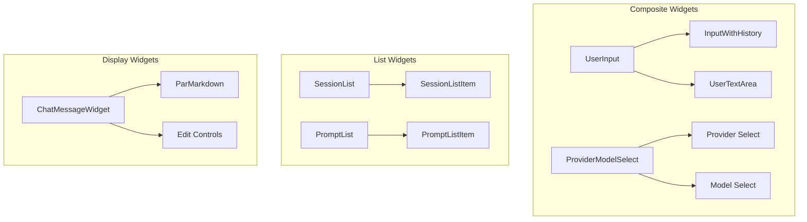

### Widget Communication Patterns

1. **Message Registration**: Widgets subscribe to specific events
2. **Reactive Properties**: State changes trigger UI updates
3. **Focus Management**: Coordinated focus handling
4. **Event Delegation**: Parent widgets handle child events

## Key Design Patterns

### 1. Singleton Managers
```python
# Global instances for cross-component access
settings = Settings()
theme_manager = ThemeManager()
provider_manager = ProviderManager()
```

### 2. Message-Based Architecture
```python
# Decoupled communication
self.app.post_message(LocalModelPullRequested(model_name))
# Registered widgets receive notification
```

### 3. Lazy Loading
```python
# Load data only when needed
def load_messages(self):
    if self._messages_loaded:
        return
    self._messages = self._load_from_disk()
```

### 4. Worker Pattern
```python
@work(thread=True, group="model_ops")
async def do_operation():
    # Long-running background operation
```

### 5. Factory Pattern
```python
def build_chat_model(self) -> BaseChatModel:
    # Create provider-specific model instance
```

## Architecture Diagrams

### Complete System Architecture

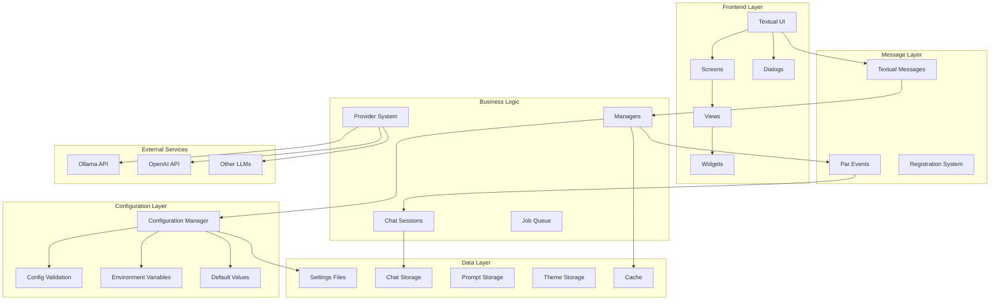

### State Management Flow

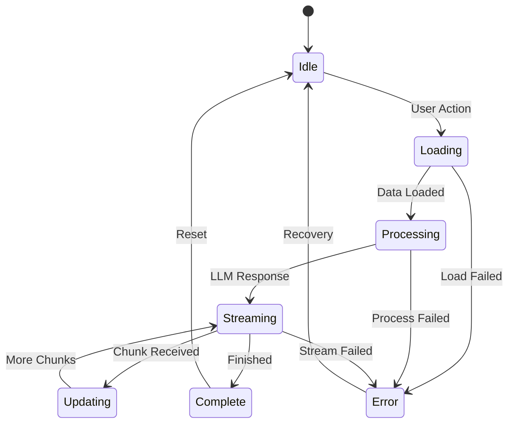

## Performance Considerations

1. **Async Operations**: Non-blocking UI with background processing
2. **Streaming Responses**: Real-time LLM output display
3. **Efficient Updates**: Batched UI updates on timers
4. **Resource Management**: Proper cleanup of subscriptions
5. **Caching Strategy**: Local caching reduces API calls

## Security Architecture

1. **API Key Protection**: 
   - Environment variables
   - Encrypted secrets vault
   - Separate storage from settings

2. **Session Encryption**: Optional password protection
3. **Input Validation**: URL and path validation
4. **Secure Defaults**: Conservative security settings

## Extensibility Points

1. **New Providers**: Add to provider_manager.py
2. **Custom Widgets**: Extend base widget classes
3. **New Commands**: Add to slash command system
4. **Theme Creation**: JSON-based theme files
5. **Message Types**: Extend message definitions

## Memory Leak Fixes Implementation

### Overview
Three critical memory leak issues were identified and resolved to ensure stable long-term operation:

### 1. Widget Subscription Management
**Problem**: The `notify_subs` dictionary in `app.py` retained references to destroyed widgets indefinitely.

**Solution**: 
- Replaced `set[MessagePump]` with `WeakSet[MessagePump]` in the subscription system
- WeakSet automatically removes references when widgets are garbage collected
- No manual cleanup required for dead widget references

**Implementation**:
```python
# In app.py
from weakref import WeakSet
self.notify_subs: dict[str, WeakSet[MessagePump]] = {"*": WeakSet[MessagePump]()}
```

### 2. Bounded Job Queue
**Problem**: The job queue had no size limit and could grow unbounded if jobs were added faster than processed.

**Solution**:
- Implemented bounded queue with maxsize=150
- Added `add_job_to_queue()` helper method with error handling
- User notification when queue is full

**Implementation**:
```python
# Bounded queue initialization
self.job_queue = Queue[QueueJob](maxsize=150)

# Safe job addition with error handling
def add_job_to_queue(self, job: QueueJob) -> bool:
    try:
        self.job_queue.put(job, timeout=0.1)
        return True
    except Full:
        self.status_notify("Job queue is full...", severity="warning")
        return False
```

### 3. Widget Cleanup on Unmount
**Problem**: Widgets that registered for updates didn't unregister when unmounted, causing memory leaks.

**Solution**:
- Added `on_unmount()` methods to widgets that call `RegisterForUpdates`
- Ensures `UnRegisterForUpdates` is called on widget destruction
- ChatTab also removes itself from session subscriptions

**Implementation**:
```python
def on_unmount(self) -> None:
    """Clean up when unmounting."""
    self.app.post_message(UnRegisterForUpdates(widget=self))
    # For ChatTab, also remove from session
    if hasattr(self, 'session') and self.session:
        self.session.remove_sub(self)
```

### Impact
- Memory usage remains stable during long sessions
- No accumulation of dead widget references
- Bounded resource usage for background operations
- Proper lifecycle management for all components

## Code Quality and Type Safety Improvements

### Overview
A comprehensive code quality improvement initiative was implemented to enhance type safety, eliminate code duplication, and improve maintainability. This effort targeted issues identified in the codebase review including excessive use of `Any` types, unnecessary `# type: ignore` comments, hard-coded values, and repetitive error handling patterns.

### 1. Type Annotation Enhancements
**Problem**: Several files used generic `Any` types and complex function signatures that reduced type safety and IDE support.

**Solution**:
- Replaced `Any` types with specific type annotations in high-impact files
- Improved function signatures with proper type variables
- Enhanced async function typing with `Awaitable[T]`

**Implementation**:
```python
# Before: Generic Any usage
def wrapper(*args: Any, **kwargs: Any) -> Any:
    return await func(*args, **kwargs)

# After: Specific type annotations
def wrapper(*args, **kwargs) -> T:
    return await func(*args, **kwargs)

# Async decorator improvements
def async_retry_with_backoff() -> Callable[[Callable[..., Awaitable[T]]], Callable[..., Awaitable[T]]]:
```

### 2. Type Ignore Comment Resolution
**Problem**: Multiple files contained `# type: ignore` comments that masked potential type issues.

**Solution**:
- Resolved legitimate type checking issues with proper null checks
- Fixed Docker import type issues by removing unnecessary ignores
- Preserved necessary ignores for external library compatibility

**Implementation**:
```python
# Before: Masking potential None issues
decrypted_password = self._decrypt(self._key_secure, self._derive_key(password))  # type: ignore

# After: Proper null checking
if self._key_secure is None:
    return False
decrypted_password = self._decrypt(self._key_secure, self._derive_key(password))
```

### 3. Configuration-Driven Hard-coded Values
**Problem**: Hard-coded timeout values throughout the application reduced flexibility and configurability.

**Solution**:
- Replaced hard-coded 5-second timeouts with dynamic configuration
- Enhanced notification system to use severity-based timeout settings
- Integrated with existing configuration management system

**Implementation**:
```python
# Before: Hard-coded timeout
def log_it(self, msg, severity="information", timeout: int = 5):

# After: Dynamic configuration
def log_it(self, msg, severity="information", timeout: int | None = None):
    if timeout is None:
        if severity == "error":
            timeout = int(settings.notification_timeout_error)
        elif severity == "warning":
            timeout = int(settings.notification_timeout_warning)
        else:
            timeout = int(settings.notification_timeout_info)
```

### 4. Error Handling Consolidation
**Problem**: Repetitive error handling patterns across model operations led to ~60 lines of duplicate code and maintenance burden.

**Solution**:
- Created centralized `handle_ollama_error()` method in app.py
- Consolidated error handling for all model operations (copy, pull, push, create)
- Maintained existing functionality while reducing code duplication

**Implementation**:
```python
def handle_ollama_error(
    self, operation: str, model_name: str, error: Exception, custom_handling: bool = False
) -> str:
    """Handle common Ollama error patterns."""
    if isinstance(error, ollama.ResponseError):
        error_msg = str(error)
        self.log_it(f"{operation} failed (ResponseError): {error_msg}")
        if not custom_handling:
            self.status_notify(f"{operation} failed: {error_msg}", severity="error")
        return error_msg
    elif isinstance(error, ConnectError):
        error_msg = "Cannot connect to Ollama server"
        self.log_it(f"{operation} failed: {error_msg}")
        if not custom_handling:
            self.status_notify("Cannot connect to Ollama server. Is it running?", severity="error")
        return error_msg
    else:
        error_msg = str(error)
        self.log_it(f"{operation} failed (unexpected error): {type(error).__name__}: {error_msg}")
        if not custom_handling:
            self.status_notify(f"{operation} failed: {error_msg}", severity="error")
        return error_msg

# Usage across model operations
except Exception as e:
    self.handle_ollama_error("Model pull", job.modelName, e)
    self.post_message_all(LocalModelPulled(model_name=job.modelName, success=False))
```

### Quality Metrics and Validation
- **Type Safety**: All type checks pass with 0 errors and 0 warnings
- **Code Style**: All lint checks pass with ruff formatter
- **Functionality**: Full backward compatibility maintained
- **Maintainability**: Reduced code duplication by ~60 lines
- **Configurability**: Enhanced user control over notification timeouts

### Impact
- Improved IDE support and developer experience through better type annotations
- Reduced maintenance burden through consolidated error handling patterns
- Enhanced user configurability with dynamic timeout settings
- Maintained full functionality while improving code quality
- Established patterns for future development and contributions

## Future Architecture Considerations

1. **Plugin System**: Dynamic loading of extensions
2. **RAG Integration**: Document embedding and retrieval
3. **Multi-User Support**: User profiles and permissions
4. **Cloud Sync**: Settings and session synchronization
5. **Advanced Caching**: Intelligent response caching