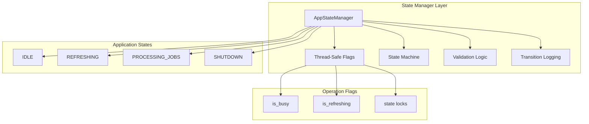

# PAR LLAMA Project Design Document

## Executive Summary

PAR LLAMA is a sophisticated Terminal User Interface (TUI) application for managing and interacting with Large Language Models (LLMs). Built on the Textual framework, it provides a comprehensive interface for both local (Ollama) and cloud-based LLM providers through a unified, extensible architecture.

## Table of Contents

1. [Architecture Overview](#architecture-overview)
2. [Application Startup and Initialization](#application-startup-and-initialization)
3. [UI Architecture](#ui-architecture)
4. [Message System and Event Flows](#message-system-and-event-flows)
5. [Data Models and Persistence](#data-models-and-persistence)
6. [Provider Integration System](#provider-integration-system)
7. [Configuration Management System](#configuration-management-system)
8. [State Management Architecture](#state-management-architecture)
9. [Widget Hierarchy](#widget-hierarchy)
10. [Key Design Patterns](#key-design-patterns)
11. [Architecture Diagrams](#architecture-diagrams)

## Architecture Overview

PAR LLAMA follows a layered architecture with clear separation of concerns:

```
┌─────────────────────────────────────────────────────────┐
│                    UI Layer (Textual)                    │
│  Screens, Views, Widgets, Dialogs, User Interactions    │
├─────────────────────────────────────────────────────────┤
│                  Message System Layer                    │
│    Textual Messages (UI) | Par Events (Background)      │
├─────────────────────────────────────────────────────────┤
│                   Business Logic Layer                   │
│  Managers, Sessions, Providers, Job Processing          │
├─────────────────────────────────────────────────────────┤
│                Configuration Management Layer            │
│   Settings Manager, Environment Variables, Validation   │
├─────────────────────────────────────────────────────────┤
│              File Validation and Security Layer          │
│  FileValidator, SecureFileOperations, Content Checking  │
├─────────────────────────────────────────────────────────┤
│                 Data Persistence Layer                   │
│   JSON Files, Settings, Themes, Sessions, Prompts       │
├─────────────────────────────────────────────────────────┤
│                  External Services Layer                 │
│      Ollama API, OpenAI, Anthropic, Other LLMs         │
└─────────────────────────────────────────────────────────┘
```

## Application Startup and Initialization

### Entry Point Flow


### Key Initialization Steps

1. **Settings Loading**: Global singleton `settings` object created
2. **Manager Registration**: Theme, Provider, Secrets, Ollama, Chat managers initialized
3. **UI Creation**: MainScreen with tabbed interface constructed
4. **Background Tasks**: Job processing and PS polling timers started

## UI Architecture

### Screen Hierarchy


### Navigation Patterns

- **Tab-based**: Primary navigation through tabbed interface
- **Modal Dialogs**: Overlays for focused interactions
- **Message-driven**: Components communicate via messages
- **Keyboard-centric**: Extensive keyboard shortcuts

## Message System and Event Flows

### Dual Message Architecture


### Key Message Flows

#### Chat Message Flow


#### Model Pull Operation


## Data Models and Persistence

### Data Architecture


### Key Data Models

- **Settings**: Application configuration, preferences
- **ChatSession**: Conversation history, LLM config, messages
- **ParllamaChatMessage**: Multi-modal messages with metadata
- **ChatPrompt**: Reusable prompt templates
- **LlmConfig**: Provider-specific model configuration

### File Validation and Security System

PAR LLAMA implements a comprehensive file validation system to protect against malicious files and ensure data integrity:

#### File Validator (`src/parllama/validators/file_validator.py`)

```python
class FileValidator:
    """Comprehensive file validator with security checks"""
    - File size validation (configurable limits per type)
    - Extension validation against allowed lists
    - Path security (directory traversal prevention)
    - Content validation for JSON, images, ZIP files
    - ZIP bomb detection with compression ratio checks
    - Image header validation for common formats
```

#### Secure File Operations (`src/parllama/secure_file_ops.py`)

```python
class SecureFileOperations:
    """Secure file operations with validation and safety"""
    - Atomic write operations (temp file + rename)
    - Automatic backup/restore on failures
    - Safe file reading with size limits
    - Directory operations with permission checks
    - Context manager for backup operations
```

#### Configuration Settings

14 new file validation settings added to `Settings` class:

```python
# File validation settings
file_validation_enabled: bool = True
max_file_size_mb: float = 10.0
max_image_size_mb: float = 5.0
max_json_size_mb: float = 20.0
max_zip_size_mb: float = 50.0
max_total_attachment_size_mb: float = 100.0
allowed_image_extensions: list[str] = [".jpg", ".jpeg", ".png", ...]
validate_file_content: bool = True
sanitize_filenames: bool = True
```

#### Security Features

- **Path Traversal Protection**: Validates file paths to prevent `../` attacks
- **File Size Limits**: Configurable limits prevent memory exhaustion
- **Content Validation**: Verifies file headers match extensions
- **ZIP Bomb Protection**: Detects suspicious compression ratios
- **Atomic Operations**: Prevents partial writes/corruption
- **Backup Recovery**: Automatic restore on operation failures

#### Integration Points

File validation is integrated into:
- **Settings Manager**: JSON configuration files
- **Chat Sessions**: Conversation persistence
- **Chat Prompts**: Template storage
- **Image Caching**: Downloaded image validation
- **Theme Manager**: Theme file validation
- **Fabric Import**: ZIP file validation

### Persistence Features

- **Lazy Loading**: Sessions/prompts loaded on-demand
- **Auto-save**: Changes saved immediately with dirty tracking
- **Encryption**: Optional password protection for sessions
- **Migration**: Automatic path migration to XDG standards

## Provider Integration System

### Provider Architecture


### Provider Features

- **Unified Interface**: All providers accessed through same API
- **Dynamic Discovery**: Models fetched from provider APIs
- **Caching**: Model lists cached locally (configurable per-provider expiration)
- **Security**: Multi-layer API key protection
- **Extensibility**: Easy to add new providers
- **Provider Disable System**: Comprehensive disable functionality to prevent timeouts

### Provider Disable System

PAR LLAMA implements a comprehensive provider disable system that allows users to explicitly disable providers to prevent connection timeouts and improve performance.

#### Architecture

```mermaid
graph TD
    subgraph "Settings Layer"
        A[disabled_providers: dict[LlmProvider, bool]]
        A --> B[UI Checkboxes]
        A --> C[Settings Persistence]
        A --> D[Backward Compatibility]
    end
    
    subgraph "Provider Manager Layer"
        E[refresh_models()]
        E --> F[Check disabled_providers]
        F --> G[Skip Disabled Providers]
        F --> H[Process Enabled Providers]
    end
    
    subgraph "UI Layer"
        I[ProviderModelSelect]
        I --> J[get_filtered_provider_select_options()]
        J --> K[Filter Disabled Providers]
        K --> L[UI Dropdowns]
    end
    
    subgraph "Options Screen"
        M[_create_disable_checkbox()]
        M --> N[Per-Provider Checkboxes]
        N --> O[Event Handler]
        O --> P[Provider Name Mapping]
    end
    
    A --> E
    A --> I
    B --> A
```

#### Core Components

**1. Settings Integration**
```python
# Settings storage for all providers
disabled_providers: dict[LlmProvider, bool] = {
    LlmProvider.OLLAMA: False,
    LlmProvider.LLAMACPP: False,
    LlmProvider.OPENAI: False,
    # ... all providers default to False (enabled)
}
```

**2. Provider Manager Integration**
```python
def refresh_models(self):
    for p in llm_provider_types:
        # Check if provider is explicitly disabled
        if settings.disabled_providers.get(p, False):
            continue  # Skip disabled providers entirely
        
        if not is_provider_api_key_set(p):
            continue  # Skip providers without API keys
        
        # Process enabled providers...
```

**3. UI Filtering**
```python
def get_filtered_provider_select_options() -> list[tuple[str, LlmProvider]]:
    """Get provider select options with disabled providers filtered out."""
    opts = get_provider_select_options()
    # Filter out any disabled providers
    opts = [(name, provider) for name, provider in opts 
            if not settings.disabled_providers.get(provider, False)]
    return opts
```

**4. Options Screen Integration**
```python
def _create_disable_checkbox(self, provider: LlmProvider) -> ComposeResult:
    """Create disable checkbox for a provider."""
    provider_name = provider.value.lower()
    yield Checkbox(
        label=f"Disable {provider.value} Provider",
        value=settings.disabled_providers.get(provider, False),
        id=f"disable_{provider_name}_provider",
    )
```

#### Features

**1. Universal Coverage**
- All 12 providers (Ollama, OpenAI, Anthropic, Groq, etc.) have disable functionality
- Consistent UI pattern across all provider sections

**2. Smart Event Handling**
- Automatic provider name mapping from checkbox IDs to enum values
- Handles case conversion issues (e.g., "llamacpp" → "LlamaCpp")
- Robust error handling for unknown providers

**3. Backward Compatibility**
- Legacy `disable_litellm_provider` setting automatically migrated
- Existing configurations continue to work without modification
- All providers default to enabled state

**4. Performance Benefits**
- Disabled providers skipped during model refresh operations
- Prevents timeout issues when providers are not running
- Reduces unnecessary network requests

**5. UI Integration**
- Disabled providers excluded from dropdown menus
- Real-time filtering of available providers
- Clear visual indication in Options screen

#### Provider Name Mapping

The system handles provider name conversion for robust checkbox event handling:

```python
provider_name_map = {
    "ollama": "Ollama",
    "llamacpp": "LlamaCpp",    # Handles case conversion
    "openai": "OpenAI",
    "litellm": "LiteLLM",
    "xai": "XAI",
    # ... comprehensive mapping for all providers
}
```

#### Use Cases

1. **Connection Timeout Prevention**: Disable LiteLLM when not running to prevent refresh timeouts
2. **Performance Optimization**: Disable unused cloud providers to speed up model refresh
3. **Network-Limited Environments**: Disable cloud providers when working offline
4. **Selective Provider Usage**: Focus on specific providers for particular workflows

#### Implementation Benefits

1. **User Control**: Explicit control over which providers are active
2. **Timeout Prevention**: Eliminates connection timeouts for unavailable providers  
3. **Performance**: Faster model refresh by skipping disabled providers
4. **Flexibility**: Easy to enable/disable providers based on current needs
5. **Robustness**: Comprehensive error handling and validation

## Configuration Management System

PAR LLAMA implements a comprehensive configuration management system that centralizes all configurable parameters and eliminates hard-coded values throughout the application.

### Configuration Architecture


### Configuration Categories

#### 1. Timer and Job Processing Settings
- **job_timer_interval**: Job processing loop interval (default: 1.0s)
- **ps_timer_interval**: Process status update interval (default: 1.0s)
- **model_refresh_timer_interval**: Model list refresh delay (default: 1.0s)
- **job_queue_put_timeout**: Queue insertion timeout (default: 0.1s)
- **job_queue_get_timeout**: Queue retrieval timeout (default: 1.0s)

#### 2. Queue Management Settings
- **job_queue_max_size**: Maximum job queue capacity (default: 150)

#### 3. HTTP Timeout Settings
- **http_request_timeout**: General HTTP request timeout (default: 10.0s)
- **provider_model_request_timeout**: Provider model API timeout (default: 5.0s)
- **update_check_timeout**: Version check timeout (default: 5.0s)
- **image_fetch_timeout**: Image download timeout (default: 10.0s)

#### 4. Notification Timeout Settings
- **notification_timeout_error**: Error notifications (default: 5.0s)
- **notification_timeout_info**: Information notifications (default: 3.0s)
- **notification_timeout_warning**: Warning notifications (default: 5.0s)
- **notification_timeout_extended**: Extended notifications (default: 8.0s)

#### 5. Theme and UI Settings
- **theme_fallback_name**: Default theme when none specified (default: "par_dark")

#### 6. Image Processing Settings
- **image_fetch_max_attempts**: Retry attempts for image downloads (default: 2)
- **image_fetch_base_delay**: Base delay between retries (default: 1.0s)

### Configuration Features

#### Backward Compatibility
- All new configuration fields have sensible defaults
- Existing settings files continue to work without modification
- Gradual migration: settings are added to config file on next save

#### Validation and Safety
- Minimum value validation (e.g., timeouts ≥ 0.1s, queue size ≥ 10)
- Type safety with Pydantic models
- Graceful fallback to defaults for invalid values

#### Environment Variable Integration
- Consistent naming convention: `PARLLAMA_*`
- Automatic loading from `.env` files
- CLI argument override support

#### Dynamic Configuration
- Settings automatically saved when modified through UI
- Hot-reload capability for most settings
- No application restart required for most changes

### Usage Examples

```python
# Accessing configuration values
from parllama.settings_manager import settings

# Use configurable timeouts instead of hard-coded values
response = requests.get(url, timeout=settings.http_request_timeout)

# Use configurable notification timeouts
self.notify("Error occurred", severity="error", 
           timeout=settings.notification_timeout_error)

# Use configurable job queue settings
queue = Queue(maxsize=settings.job_queue_max_size)
queue.put(job, timeout=settings.job_queue_put_timeout)
```

### Benefits

1. **Flexibility**: Users can tune performance for their environment
2. **Debugging**: Easier to adjust timeouts for troubleshooting
3. **Performance Optimization**: Settings can be optimized for different network conditions
4. **Consistency**: Centralized configuration management across the application
5. **Maintainability**: Easier to update configuration values globally
6. **User Control**: UI-configurable settings reduce need for code changes

## State Management Architecture

PAR LLAMA implements a centralized state management system that addresses previous inconsistencies in state flag handling and provides a formal state machine for complex operations.

### State Management Overview



### Core Components

#### AppStateManager (`src/parllama/state_manager.py`)

```python
class AppStateManager:
    """Centralized manager for application state"""
    - Thread-safe state flag management
    - Formal state machine with validation
    - State transition logging
    - Operation conflict detection
    - Graceful shutdown handling
```

#### Application States

- **IDLE**: Application ready for new operations
- **REFRESHING**: Model lists being refreshed from external sources  
- **PROCESSING_JOBS**: Background jobs (pull, push, create, copy) in progress
- **SHUTDOWN**: Application shutting down, no new operations allowed

#### State Transition Validation

```python
_valid_transitions = {
    AppState.IDLE: {AppState.REFRESHING, AppState.PROCESSING_JOBS, AppState.SHUTDOWN},
    AppState.REFRESHING: {AppState.IDLE, AppState.SHUTDOWN},
    AppState.PROCESSING_JOBS: {AppState.IDLE, AppState.SHUTDOWN},
    AppState.SHUTDOWN: set(),  # No transitions allowed from shutdown
}
```

### Thread Safety Implementation

#### Before: Inconsistent Synchronization
```python
# is_busy had proper locking
with self.is_busy_lock:
    self.is_busy = True

# is_refreshing had no synchronization (race condition risk)
self.is_refreshing = True
```

#### After: Consistent Thread Safety
```python
# Both flags managed through state manager with proper locking
self.state_manager.set_busy(True, "processing PullModelJob")
self.state_manager.set_refreshing(True, "local models")
```

### State Manager Features

#### 1. Operation Conflict Detection
```python
def can_start_operation(self, operation_type: str = "operation") -> tuple[bool, str]:
    """Check if a new operation can be started"""
    if self.current_state == AppState.SHUTDOWN:
        return False, "Application is shutting down"
    
    if self.is_refreshing:
        return False, "A model refresh is already in progress. Please wait."
    
    if self.is_busy:
        return False, "A job is already in progress. Please wait."
    
    return True, ""
```

#### 2. Automatic State Transitions
```python
def set_busy(self, busy: bool, operation: str = "") -> bool:
    """Set busy state and auto-transition main state"""
    # Update busy flag
    self._is_busy = busy
    
    # Auto-transition main application state
    if busy and self.current_state == AppState.IDLE:
        self._transition_to(AppState.PROCESSING_JOBS, f"job processing ({operation})")
    elif not busy and self.current_state == AppState.PROCESSING_JOBS:
        self._transition_to(AppState.IDLE, f"job completed ({operation})")
```

#### 3. Comprehensive State Logging
```python
# Detailed logging for all state changes
self._log(f"Job processor state changed: {not busy} -> {busy} ({operation})")
self._log(f"State transition: {old_state.value} -> {new_state.value} ({operation})")
```

### Integration with Application Components

#### Model Operations
```python
# Before: Manual flag management scattered across methods
with self.is_busy_lock:
    self.is_busy = True
    self.log_it(f"Job processor busy state changed: False -> True")

# After: Centralized state management
job_type = type(job).__name__
self.state_manager.set_busy(True, f"processing {job_type}")
```

#### Refresh Operations
```python
# Before: No synchronization for refresh operations
def on_model_list_refresh_requested(self) -> None:
    if self.is_refreshing:  # Race condition risk
        self.status_notify("A model refresh is already in progress. Please wait.")
        return

# After: Thread-safe operation conflict detection
def on_model_list_refresh_requested(self) -> None:
    can_start, error_msg = self.state_manager.can_start_operation("model refresh")
    if not can_start:
        self.status_notify(error_msg)
        return
```

### State Management Benefits

1. **Thread Safety**: Eliminates race conditions in state flag management
2. **Consistency**: Standardized state management patterns across the application
3. **Observability**: Comprehensive logging of all state transitions
4. **Conflict Prevention**: Prevents overlapping operations that could cause issues
5. **Debugging**: Clear state information available for troubleshooting
6. **Extensibility**: Easy to add new states and operations
7. **Maintainability**: Centralized state logic reduces code duplication

### Usage Examples

```python
# Initialize state manager with logging
self.state_manager = initialize_state_manager(self.log_it)

# Check if operation can start
can_start, error_msg = self.state_manager.can_start_operation("site model refresh")
if not can_start:
    self.status_notify(error_msg)
    return

# Set operation states with descriptive messages
self.state_manager.set_refreshing(True, "site models: library")
try:
    # Perform operation
    perform_refresh()
finally:
    self.state_manager.set_refreshing(False, "site models: library")

# Get comprehensive state information for debugging
state_info = self.state_manager.get_state_info()
# Returns: {"current_state": "idle", "is_busy": false, "is_refreshing": false, "is_idle": true}
```

### Migration from Previous Implementation

The state management system was designed to be backward compatible while fixing the identified inconsistencies:

1. **Removed Direct Flag Access**: Eliminated direct manipulation of `is_busy` and `is_refreshing` flags
2. **Added Thread Safety**: All state changes now use proper locking mechanisms  
3. **Centralized Logic**: Moved scattered state management code to a single, well-tested class
4. **Enhanced Logging**: Added comprehensive state transition logging for debugging
5. **Formal State Machine**: Implemented proper state validation and transition rules

This architecture resolves todo item #8 (State Management Inconsistencies) by providing a robust, thread-safe, and maintainable state management system.

## Widget Hierarchy

### Widget Composition


### Widget Communication Patterns

1. **Message Registration**: Widgets subscribe to specific events
2. **Reactive Properties**: State changes trigger UI updates
3. **Focus Management**: Coordinated focus handling
4. **Event Delegation**: Parent widgets handle child events

## Key Design Patterns

### 1. Singleton Managers
```python
# Global instances for cross-component access
settings = Settings()
theme_manager = ThemeManager()
provider_manager = ProviderManager()
```

### 2. Message-Based Architecture
```python
# Decoupled communication
self.app.post_message(LocalModelPullRequested(model_name))
# Registered widgets receive notification
```

### 3. Lazy Loading
```python
# Load data only when needed
def load_messages(self):
    if self._messages_loaded:
        return
    self._messages = self._load_from_disk()
```

### 4. Worker Pattern
```python
@work(thread=True, group="model_ops")
async def do_operation():
    # Long-running background operation
```

### 5. Factory Pattern
```python
def build_chat_model(self) -> BaseChatModel:
    # Create provider-specific model instance
```

## Architecture Diagrams

### Complete System Architecture


### State Management Flow


## Performance Considerations

1. **Async Operations**: Non-blocking UI with background processing
2. **Streaming Responses**: Real-time LLM output display
3. **Efficient Updates**: Batched UI updates on timers
4. **Resource Management**: Proper cleanup of subscriptions
5. **Caching Strategy**: Local caching reduces API calls

## Security Architecture

1. **API Key Protection**: 
   - Environment variables
   - Encrypted secrets vault
   - Separate storage from settings

2. **Session Encryption**: Optional password protection
3. **Input Validation**: URL and path validation
4. **Secure Defaults**: Conservative security settings

## Extensibility Points

1. **New Providers**: Add to provider_manager.py
2. **Custom Widgets**: Extend base widget classes
3. **New Commands**: Add to slash command system
4. **Theme Creation**: JSON-based theme files
5. **Message Types**: Extend message definitions

## Memory Leak Fixes Implementation

### Overview
Three critical memory leak issues were identified and resolved to ensure stable long-term operation:

### 1. Widget Subscription Management
**Problem**: The `notify_subs` dictionary in `app.py` retained references to destroyed widgets indefinitely.

**Solution**: 
- Replaced `set[MessagePump]` with `WeakSet[MessagePump]` in the subscription system
- WeakSet automatically removes references when widgets are garbage collected
- No manual cleanup required for dead widget references

**Implementation**:
```python
# In app.py
from weakref import WeakSet
self.notify_subs: dict[str, WeakSet[MessagePump]] = {"*": WeakSet[MessagePump]()}
```

### 2. Bounded Job Queue
**Problem**: The job queue had no size limit and could grow unbounded if jobs were added faster than processed.

**Solution**:
- Implemented bounded queue with maxsize=150
- Added `add_job_to_queue()` helper method with error handling
- User notification when queue is full

**Implementation**:
```python
# Bounded queue initialization
self.job_queue = Queue[QueueJob](maxsize=150)

# Safe job addition with error handling
def add_job_to_queue(self, job: QueueJob) -> bool:
    try:
        self.job_queue.put(job, timeout=0.1)
        return True
    except Full:
        self.status_notify("Job queue is full...", severity="warning")
        return False
```

### 3. Widget Cleanup on Unmount
**Problem**: Widgets that registered for updates didn't unregister when unmounted, causing memory leaks.

**Solution**:
- Added `on_unmount()` methods to widgets that call `RegisterForUpdates`
- Ensures `UnRegisterForUpdates` is called on widget destruction
- ChatTab also removes itself from session subscriptions

**Implementation**:
```python
def on_unmount(self) -> None:
    """Clean up when unmounting."""
    self.app.post_message(UnRegisterForUpdates(widget=self))
    # For ChatTab, also remove from session
    if hasattr(self, 'session') and self.session:
        self.session.remove_sub(self)
```

### Impact
- Memory usage remains stable during long sessions
- No accumulation of dead widget references
- Bounded resource usage for background operations
- Proper lifecycle management for all components

## Code Quality and Type Safety Improvements

### Overview
A comprehensive code quality improvement initiative was implemented to enhance type safety, eliminate code duplication, and improve maintainability. This effort targeted issues identified in the codebase review including excessive use of `Any` types, unnecessary `# type: ignore` comments, hard-coded values, and repetitive error handling patterns.

### 1. Type Annotation Enhancements
**Problem**: Several files used generic `Any` types and complex function signatures that reduced type safety and IDE support.

**Solution**:
- Replaced `Any` types with specific type annotations in high-impact files
- Improved function signatures with proper type variables
- Enhanced async function typing with `Awaitable[T]`

**Implementation**:
```python
# Before: Generic Any usage
def wrapper(*args: Any, **kwargs: Any) -> Any:
    return await func(*args, **kwargs)

# After: Specific type annotations
def wrapper(*args, **kwargs) -> T:
    return await func(*args, **kwargs)

# Async decorator improvements
def async_retry_with_backoff() -> Callable[[Callable[..., Awaitable[T]]], Callable[..., Awaitable[T]]]:
```

### 2. Type Ignore Comment Resolution
**Problem**: Multiple files contained `# type: ignore` comments that masked potential type issues.

**Solution**:
- Resolved legitimate type checking issues with proper null checks
- Fixed Docker import type issues by removing unnecessary ignores
- Preserved necessary ignores for external library compatibility

**Implementation**:
```python
# Before: Masking potential None issues
decrypted_password = self._decrypt(self._key_secure, self._derive_key(password))  # type: ignore

# After: Proper null checking
if self._key_secure is None:
    return False
decrypted_password = self._decrypt(self._key_secure, self._derive_key(password))
```

### 3. Configuration-Driven Hard-coded Values
**Problem**: Hard-coded timeout values throughout the application reduced flexibility and configurability.

**Solution**:
- Replaced hard-coded 5-second timeouts with dynamic configuration
- Enhanced notification system to use severity-based timeout settings
- Integrated with existing configuration management system

**Implementation**:
```python
# Before: Hard-coded timeout
def log_it(self, msg, severity="information", timeout: int = 5):

# After: Dynamic configuration
def log_it(self, msg, severity="information", timeout: int | None = None):
    if timeout is None:
        if severity == "error":
            timeout = int(settings.notification_timeout_error)
        elif severity == "warning":
            timeout = int(settings.notification_timeout_warning)
        else:
            timeout = int(settings.notification_timeout_info)
```

### 4. Error Handling Consolidation
**Problem**: Repetitive error handling patterns across model operations led to ~60 lines of duplicate code and maintenance burden.

**Solution**:
- Created centralized `handle_ollama_error()` method in app.py
- Consolidated error handling for all model operations (copy, pull, push, create)
- Maintained existing functionality while reducing code duplication

**Implementation**:
```python
def handle_ollama_error(
    self, operation: str, model_name: str, error: Exception, custom_handling: bool = False
) -> str:
    """Handle common Ollama error patterns."""
    if isinstance(error, ollama.ResponseError):
        error_msg = str(error)
        self.log_it(f"{operation} failed (ResponseError): {error_msg}")
        if not custom_handling:
            self.status_notify(f"{operation} failed: {error_msg}", severity="error")
        return error_msg
    elif isinstance(error, ConnectError):
        error_msg = "Cannot connect to Ollama server"
        self.log_it(f"{operation} failed: {error_msg}")
        if not custom_handling:
            self.status_notify("Cannot connect to Ollama server. Is it running?", severity="error")
        return error_msg
    else:
        error_msg = str(error)
        self.log_it(f"{operation} failed (unexpected error): {type(error).__name__}: {error_msg}")
        if not custom_handling:
            self.status_notify(f"{operation} failed: {error_msg}", severity="error")
        return error_msg

# Usage across model operations
except Exception as e:
    self.handle_ollama_error("Model pull", job.modelName, e)
    self.post_message_all(LocalModelPulled(model_name=job.modelName, success=False))
```

### Quality Metrics and Validation
- **Type Safety**: All type checks pass with 0 errors and 0 warnings
- **Code Style**: All lint checks pass with ruff formatter
- **Functionality**: Full backward compatibility maintained
- **Maintainability**: Reduced code duplication by ~60 lines
- **Configurability**: Enhanced user control over notification timeouts

### Impact
- Improved IDE support and developer experience through better type annotations
- Reduced maintenance burden through consolidated error handling patterns
- Enhanced user configurability with dynamic timeout settings
- Maintained full functionality while improving code quality
- Established patterns for future development and contributions

## Future Architecture Considerations

1. **Plugin System**: Dynamic loading of extensions
2. **RAG Integration**: Document embedding and retrieval
3. **Multi-User Support**: User profiles and permissions
4. **Cloud Sync**: Settings and session synchronization
5. **Advanced Caching**: Intelligent response caching